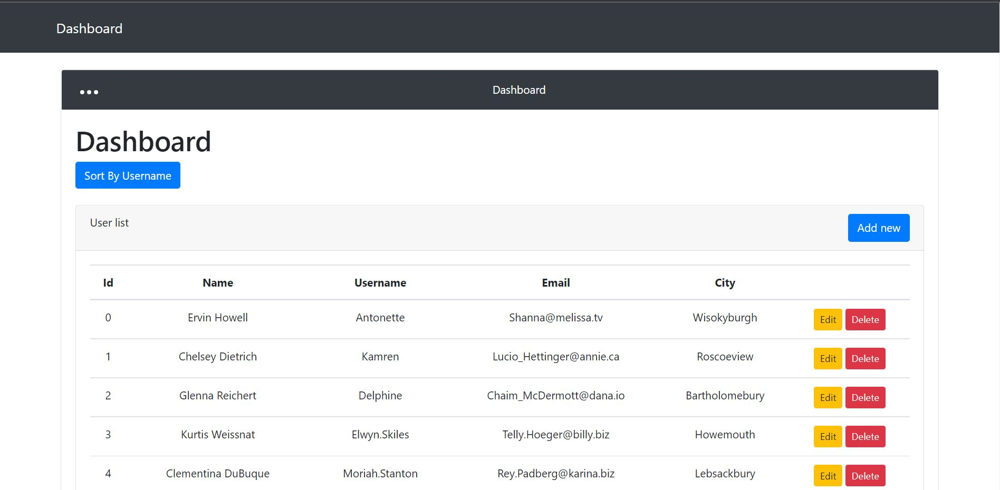
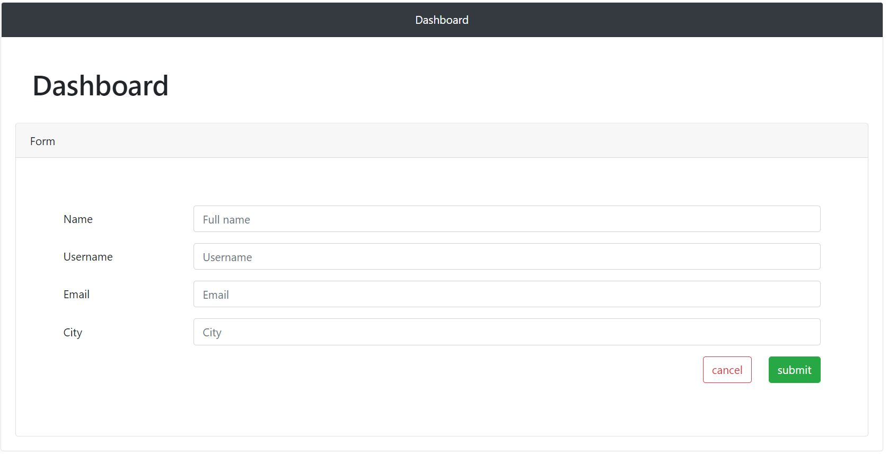
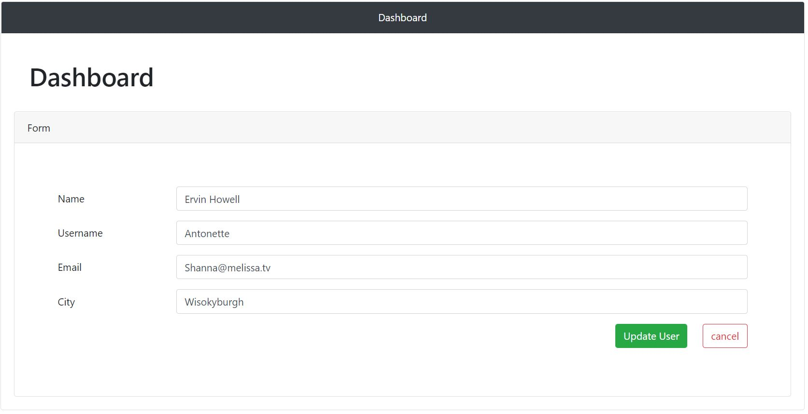
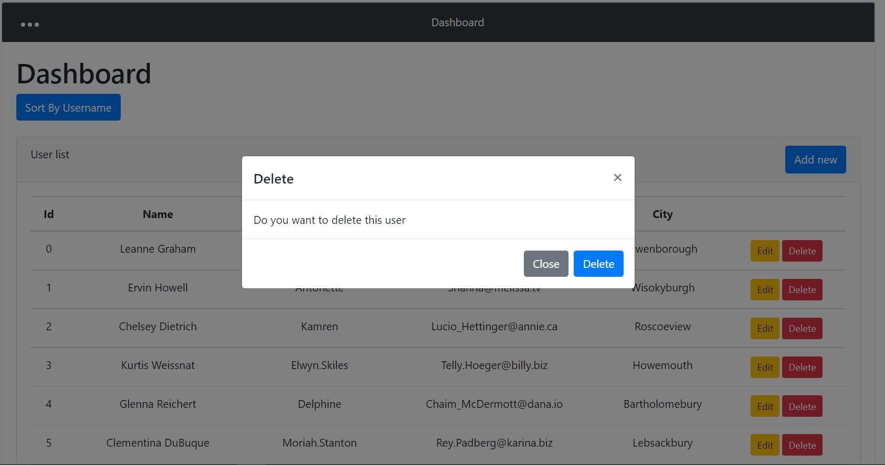

# react-redux-user-management

visit app here [User Management App](https://userr-management.netlify.app/).






### Install

```
npm install --save
```

In the project root directory, you can run:

### `npm start`

Runs the app in the development mode.\
Open [http://localhost:3000](http://localhost:3000) to view it in the browser.

The page will reload if you make edits.\
You will also see any lint errors in the console.

### Features

- VIEW USERS
- ADD USER
- UPATE USER
- DELETE USER

- TOAST NOTIFICATIONS
- MODAL POP UP
- SORTING BY USERNAME

### Usage

```jsx
import React from "react";

const Modal = (props) => {
  const { title, bodyText, action, userId, onDeleteClick } = props;

  return (
    <>
      <div
        className="modal fade"
        id="exampleModalCenter"
        tabIndex="-1"
        role="dialog"
        aria-labelledby="exampleModalCenterTitle"
        aria-hidden="true"
      >
        <div className="modal-dialog modal-dialog-centered" role="document">
          <div className="modal-content">
            <div className="modal-header">
              <h5 className="modal-title" id="exampleModalCenterTitle">
                {title}
              </h5>
              <button
                type="button"
                className="close"
                data-dismiss="modal"
                aria-label="Close"
              >
                <span aria-hidden="true">&times;</span>
              </button>
            </div>
            <div className="modal-body">{bodyText}</div>
            <div className="modal-footer">
              <button
                type="button"
                className="btn btn-secondary"
                data-dismiss="modal"
              >
                Close
              </button>
              <button
                type="button"
                className="btn btn-primary"
                data-dismiss="modal"
                onClick={() => onDeleteClick(userId)}
              >
                {action}
              </button>
            </div>
          </div>
        </div>
      </div>
    </>
  );
};

export default Modal;
```

## Props

- `title` {string}: Modal Title. Placeholder text (e.g. `{ title: 'DELETE MODAL' }`) \*
- `bodyText` {string}: Modal Body. Placeholder text (e.g. `{ bodyText: 'Would you like to delete this user? ' }`) \*
- `action` {string}: Name of the action to triger (e.g ). `Delete` \*
- `onDeleteClick` {func}: A callback function that will be called when the user initiates a delete. \*
- `userId` {string | number}: The user's id to be deleted. \*

## Development

Here's how you can get started developing locally:

    $ git clone https://github.com/Nierowheezy/react-redux-user-management
    $ cd react-redux-user-management
    $ npm install
    $ npm start

Now, if you go to `http://localhost:3000` in your browser, you should see the demo page.

## LICENSE

This project is licensed under the [MIT License](LICENSE.md).

###### Made with ❤️ at [OLANIYI OLABODE DAVID](https://nierowheezy.netlify.app).
